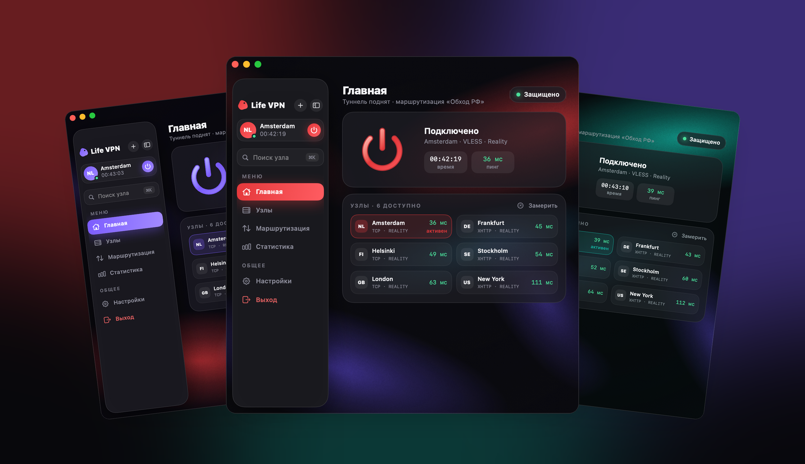
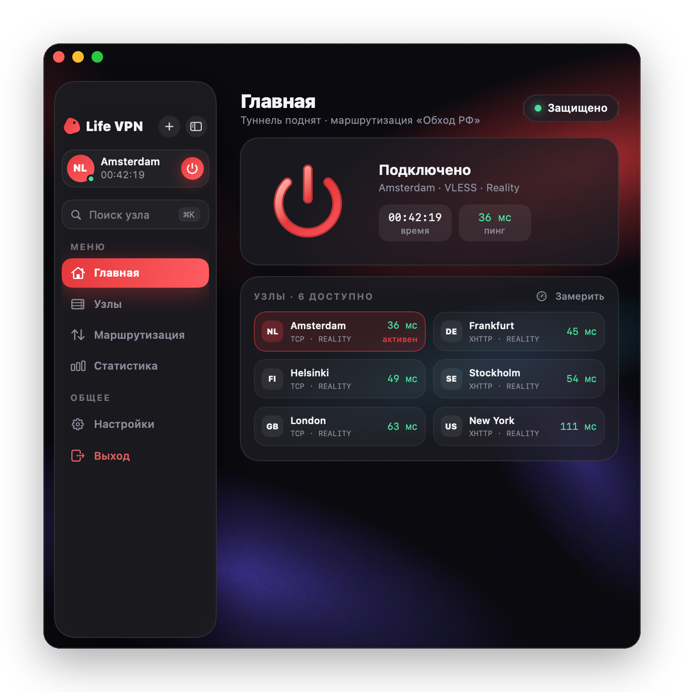
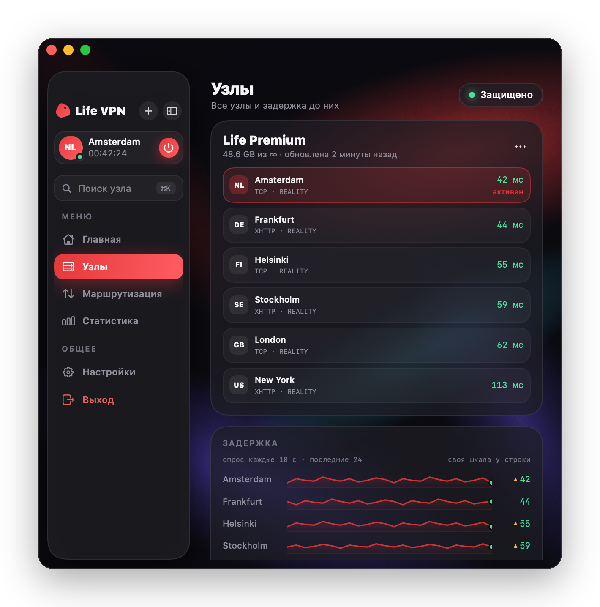
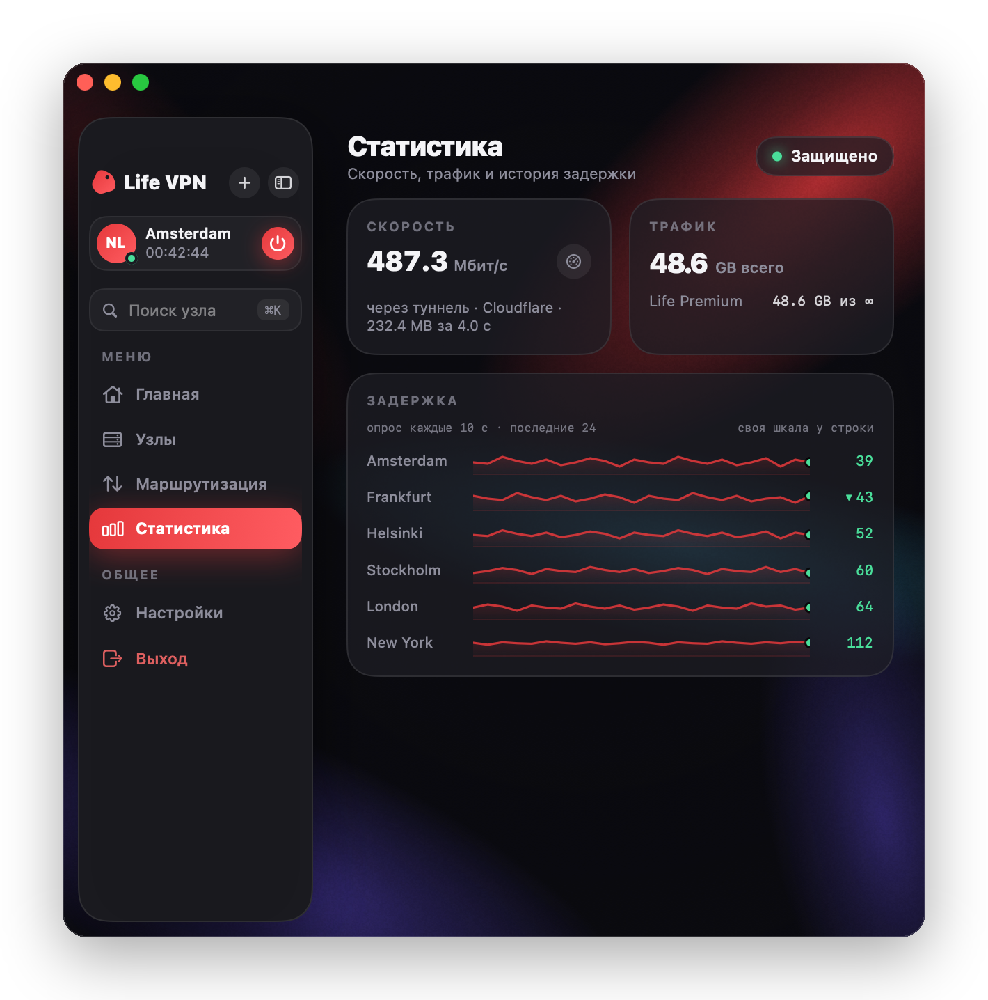
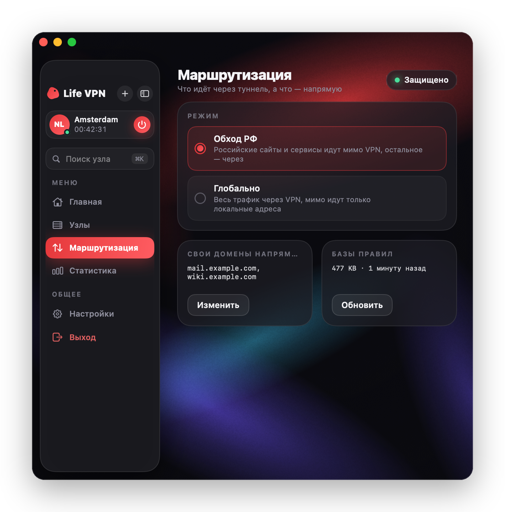
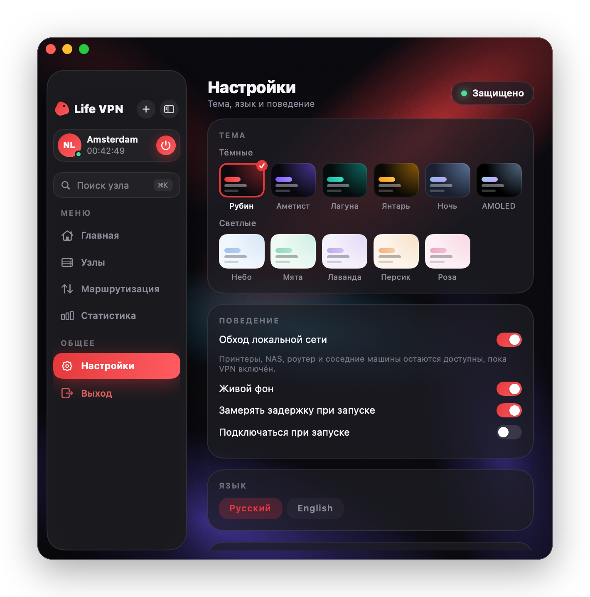
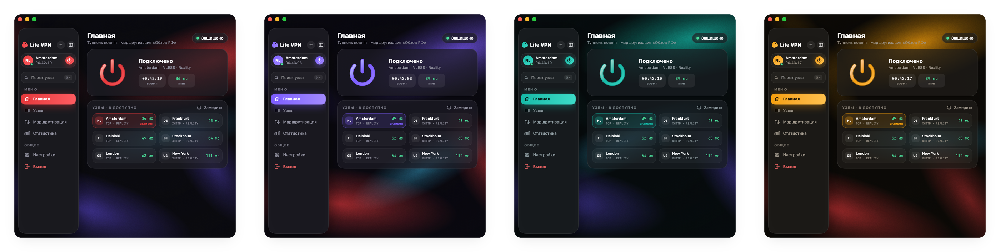

  

<h1 align="center">Life VPN</h1>

  <b>VPN для Mac, который хочется открывать.</b> 
  Одна кнопка, быстрые узлы и аккуратный интерфейс — без лишних экранов и настроек.

  
  
  
  

  <a href="https://github.com/stailegrow/lifevpn-macos/releases/latest"><b>⬇ Скачать для macOS</b></a>
  &nbsp;·&nbsp; <a href="#установка">Установка</a>
  &nbsp;·&nbsp; <a href="#english">English</a>

---

## Одна кнопка — и вы под защитой

Нажали на знак питания — он загорается неоном, а рядом бегут время сессии и
пинг до узла. Больше ничего делать не нужно: маршруты, DNS и системный прокси
Life VPN настраивает сам.

  

## Всё под рукой, ничего лишнего

<table>
  <tr>
    <td width="50%" valign="top">
      
      <h3>Узлы</h3>
      Все узлы подписки с живой задержкой. Поиск по <kbd>⌘K</kbd> находит нужный за секунду.
    </td>
    <td width="50%" valign="top">
      
      <h3>Статистика</h3>
      Замер скорости в пару кликов, расход трафика и история задержки по каждому узлу.
    </td>
  </tr>
  <tr>
    <td width="50%" valign="top">
      
      <h3>Маршрутизация</h3>
      Российские сайты идут напрямую, остальное — через туннель. Свои домены и локальная сеть — мимо VPN.
    </td>
    <td width="50%" valign="top">
      
      <h3>Настройки</h3>
      Одиннадцать тем, живой фон, автоподключение при запуске, русский и английский.
    </td>
  </tr>
</table>

## Ваш цвет

Рубин, Аметист, Лагуна, Янтарь и ещё семь тем — тёмных и светлых.
Живой фон «северное сияние» переливается оттенками выбранной темы.

  

## Что внутри

**Подключение**
- VLESS с Reality и XTLS Vision, транспорт XHTTP — на свежем ядре Xray-core
- маршрутизация «Обход РФ»: российские сервисы напрямую, остальное через туннель
- раздельный DNS, обход локальной сети, свой список доменов «всегда напрямую»
- системный прокси снимается при выходе и восстанавливается после сбоя

**Подписки**
- добавление ссылкой, из буфера обмена, QR-кодом с камеры или с картинки
- список узлов обновляется сам: новые узлы на панели появляются в приложении, удалённые исчезают
- трафик, срок действия и переименование подписки

**Измерения**
- задержка меряется напрямую от вашего Mac до узла — честная цифра, подключены вы или нет
- фоновый опрос раз в десять секунд и мини-графики истории по каждому узлу
- замер скорости по трём независимым источникам

**Удобство**
- значок в строке меню: зелёный, когда туннель поднят
- компактное окно с боковой панелью, которую можно свернуть до значков
- обновления приходят сами — одной кнопкой, без переустановки

## Установка

1. Скачайте `LifeVPN-<версия>.zip` со страницы [последнего релиза](https://github.com/stailegrow/lifevpn-macos/releases/latest).
2. Распакуйте архив и перенесите **LifeVPN.app** в «Программы».
3. При первом запуске macOS спросит разрешение: приложение подписано без
   учётной записи разработчика Apple. Откройте его правым кликом → «Открыть»,
   а если кнопки нет — «Системные настройки» → «Конфиденциальность и
   безопасность» → «Всё равно открыть».

Дальше Life VPN обновляется сам: когда выходит новая версия, в боковой панели
появляется карточка «Доступна версия…». Одна кнопка — и приложение
скачивает обновление, ставит его и перезапускается.

**Требования:** macOS 14 Sonoma или новее, Apple Silicon или Intel.

## Приватность

Никакой аналитики, телеметрии и учётных записей. Подписки, настройки и список
узлов хранятся только на вашем Mac. Само приложение обращается только туда, где
без этого не обойтись:

- к серверу вашей подписки — чтобы обновить список узлов;
- к самим узлам — чтобы измерить задержку;
- к CDN jsDelivr — за базами правил маршрутизации;
- к GitHub — чтобы проверить, вышла ли новая версия;
- к Cloudflare, Hetzner и CacheFly — только когда вы сами нажимаете «Проверить скорость».

## Лицензия

Life VPN — проприетарный продукт, все права защищены. Код открыт **только для
просмотра**. Копировать, изменять, собирать, распространять и создавать форки
для использования запрещено. Также запрещено копировать дизайн. Подробно — в
[LICENSE](LICENSE), условия для пользователей приложения — в [EULA.md](EULA.md).

Кнопка «Fork» на GitHub доступна у любого публичного репозитория — так
устроены правила GitHub, и отключить её нельзя. Но форк остаётся только
копией для просмотра: собирать из него приложение, менять или распространять
код лицензия не разрешает.

Ядро [Xray-core](https://github.com/XTLS/Xray-core) — отдельная программа под
лицензией MPL-2.0.

---

## English

**Life VPN is a Mac VPN client you'll actually enjoy opening.** One button,
fast nodes and a clean, focused interface.

- **One-tap connect.** The power sign lights up in neon, and the session timer
  and latency appear beside it. Routing, DNS and the system proxy are handled
  for you.
- **Nodes, statistics and routing** in a compact window with a collapsible
  sidebar and <kbd>⌘K</kbd> search.
- **VLESS with Reality, XTLS Vision and XHTTP** on a current Xray-core.
- **Subscriptions** by link, clipboard, camera QR or image, kept in sync
  automatically.
- **Honest latency**, measured straight from your Mac to each node, with
  per-node history graphs and a speed test across three sources.
- **Eleven themes** and a living aurora background.
- **Automatic updates**: new versions install with one click.

**Install:** download the zip from the
[latest release](https://github.com/stailegrow/lifevpn-macos/releases/latest)
and move **LifeVPN.app** to Applications. On first launch, right-click → Open
(or System Settings → Privacy & Security → Open Anyway), since the app is
signed without an Apple Developer account. Requires macOS 14+, Apple Silicon or
Intel.

**Privacy:** no analytics, no telemetry, no accounts. Data stays on your Mac.

**Licence:** proprietary, all rights reserved. The source is published for
viewing only. Copying, modifying, building, distributing, using forks and
copying the design are prohibited. See [LICENSE](LICENSE) and
[EULA.md](EULA.md).
